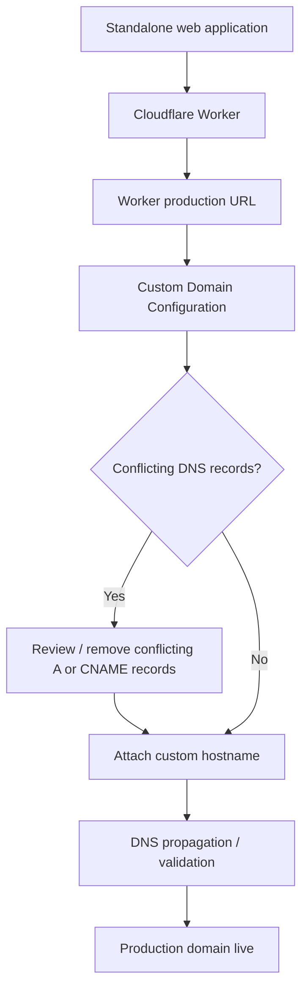

# Cloudflare Worker + Custom Domain — Technical Case Study

## Overview

This case study documents a real deployment workflow in which a standalone web project was published through **Cloudflare Workers** and connected to a custom `.com.br` domain.

The public documentation focuses on the technical process and troubleshooting decisions. Account IDs, credentials, private DNS details and client-sensitive information are intentionally excluded.

## Goal

The project needed to:

- publish a standalone web application without depending on the original site-builder hosting plan;
- serve the application through Cloudflare infrastructure;
- connect a custom Brazilian domain;
- resolve DNS conflicts that prevented the custom hostname from being attached;
- preserve the final user-facing web experience after migration.

## Deployment flow



## Main challenge — conflicting DNS records

When the custom hostname was added to the Worker, Cloudflare reported that the hostname already had externally managed DNS records such as `A` or `CNAME` records.

That meant the domain could not be attached directly until the conflicting records were reviewed.

The troubleshooting process was:

```text
Custom hostname fails
        ↓
Inspect DNS configuration
        ↓
Identify existing A / CNAME records
        ↓
Remove or replace conflicting records
        ↓
Retry custom-domain attachment
        ↓
Validate final hostname
```

## Internationalized domain handling

The custom domain contained a non-ASCII character.

For DNS and infrastructure-level configuration, the hostname can appear in **Punycode** form rather than the human-readable Unicode form.

This required recognizing that both values represented the same domain and using the DNS-compatible hostname when necessary during troubleshooting.

## Worker deployment

The application was delivered through a Cloudflare Worker deployment flow.

The final setup separated:

- the application source / standalone web file;
- the Worker service;
- the default `workers.dev` deployment URL;
- the production custom domain.

This made it possible to validate the Worker independently before connecting the final domain.

## Troubleshooting principles used

### 1. Validate the Worker first

Before debugging the custom domain, confirm that the Worker itself serves the expected content through its default Cloudflare URL.

### 2. Separate application errors from DNS errors

A working Worker with a failing custom domain usually points to hostname / DNS configuration rather than application code.

### 3. Avoid duplicate ownership of the same hostname

A hostname should not simultaneously be controlled by incompatible DNS records and a Worker custom-domain mapping.

### 4. Make changes incrementally

DNS changes were handled carefully instead of replacing unrelated records unnecessarily.

## Security and privacy

The public case study intentionally omits:

- Cloudflare account IDs;
- API tokens;
- authentication secrets;
- private client information;
- internal DNS values unrelated to the public architecture.

The goal is to document the engineering process without exposing operational secrets.

## What this project demonstrates

This deployment demonstrates practical experience with:

- Cloudflare Workers;
- custom domains;
- DNS troubleshooting;
- `A` / `CNAME` record conflicts;
- internationalized domain / Punycode awareness;
- deployment validation;
- separating infrastructure problems from application problems;
- iterative troubleshooting;
- client-facing delivery of a web project.

## Key lesson

A deployment is not complete when the code runs only on a temporary platform URL.

Production delivery also involves **DNS, domain ownership, infrastructure configuration and verification**, and problems in those layers must be debugged independently from the application itself.
