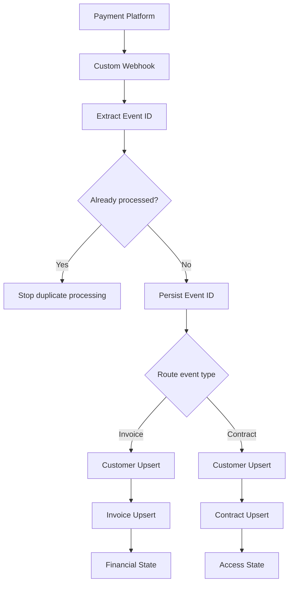

# Payment Webhook Automation — Technical Case Study

## Overview

This case study documents a practical payment-event automation designed to receive external webhook events, prevent duplicate processing and maintain synchronized customer, invoice and contract state.

The implementation was built with a low-code automation platform and persistent data stores. Sensitive credentials, webhook URLs, customer data and client-specific information are intentionally excluded.

## Problem

Payment platforms can send different event types for invoices and contracts, and the same event may be delivered more than once.

The automation needed to:

- receive payment and contract webhooks;
- avoid processing the same event twice;
- normalize customer records;
- keep invoice and contract information separated;
- derive financial and access status from incoming events;
- preserve important state when one event should not overwrite another;
- support safe testing before live use.

## Architecture



## Persistent data model

The automation used separate stores for different responsibilities:

```text
Events
Customers
Invoices
Contracts
```

### Events

Stores processed event identifiers so duplicate webhook deliveries can be detected before business logic is executed.

### Customers

Uses a normalized customer identifier to maintain one customer record across related events.

### Invoices

Stores financial information and invoice state.

### Contracts

Stores contract and access-related information separately from invoice state.

## Idempotency

A webhook provider may retry the same event. Without idempotency, the same transaction could be processed repeatedly.

The workflow checks the root event identifier before continuing:

```text
Receive event
   ↓
Extract event ID
   ↓
Already processed?
   ├─ Yes → Stop duplicate processing
   └─ No  → Persist event ID and continue
```

This keeps retries from generating duplicate business actions.

## Financial status rules

Invoice events were mapped into internal financial states.

Examples included:

| External state | Internal financial state | Access effect |
|---|---|---|
| Paid | Active | Active |
| Waiting payment | Pending | Pending / unchanged according to access rule |
| Canceled | Canceled | Existing valid access preserved |
| Refunded | Refunded | Blocked |
| Chargeback | Chargeback | Blocked |

A key design decision was that a cancellation event should not automatically remove access that is still valid for a previously paid period.

## Contract access rules

Access expiration can be available in different fields depending on the event payload.

The automation applied a priority order when resolving the access date:

```text
Content access expiration
        ↓
Current recurrence due date
        ↓
Next recurrence due date
        ↓
Contract finish date
```

The selected value was parsed as a date and compared with the current date to derive access state.

```text
Future expiration → Active
Past / current expiration → Blocked
```

Contract events were intentionally prevented from overwriting financial status when the event did not represent a financial change.

## Testing strategy

Before relying on live transactions, the workflow was tested with synthetic payloads representing different situations.

Test scenarios included:

- successful payment;
- canceled invoice;
- chargeback;
- contract update;
- duplicate webhook delivery.

The validation focused on both the stored records and the resulting access / financial state.

## What this project demonstrates

This automation demonstrates practical experience with:

- webhook-based integrations;
- event-driven workflows;
- idempotency;
- data normalization;
- routing by event type;
- persistent state;
- business-rule mapping;
- payment lifecycle logic;
- access-control logic;
- synthetic testing;
- debugging and iterative refinement.

## Security and privacy

The public case study intentionally excludes:

- webhook secrets;
- API tokens;
- credentials;
- customer records;
- personal data;
- private client URLs;
- production payloads containing sensitive information.

Only the architecture and generalized implementation decisions are documented.

## Development approach

The workflow was built iteratively:

```text
Define business rules
        ↓
Build webhook flow
        ↓
Create persistent stores
        ↓
Add idempotency
        ↓
Route event types
        ↓
Implement state rules
        ↓
Test synthetic events
        ↓
Inspect stored results
        ↓
Refine edge cases
```

The project is a practical example of combining automation tooling, system thinking and AI-assisted problem solving to turn business requirements into a working integration.
